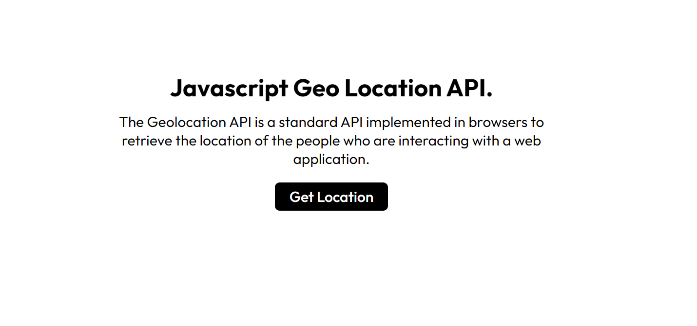
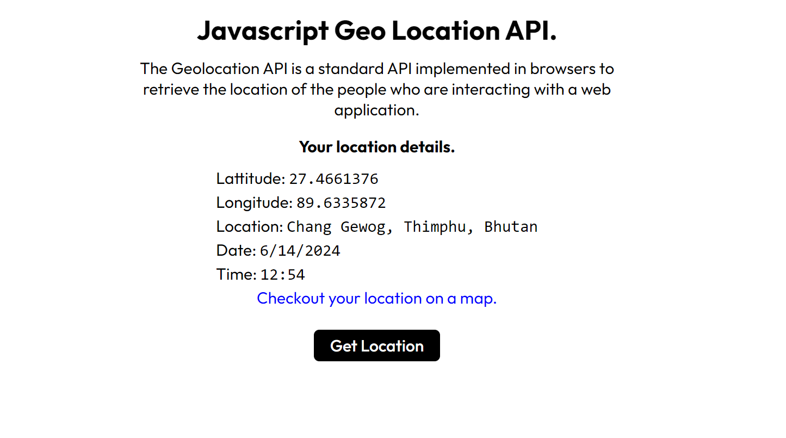
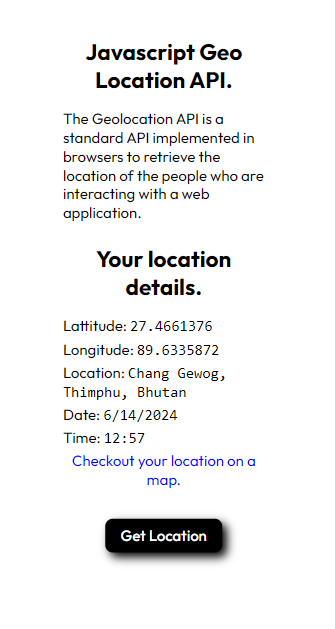

# JS-geolocation-API

## Table of content.
- [Overview.](#overview)
- [Learning.](#learning)
- [Challenges.](#challenges)
- [Terminologies.](#terminologies)
- [screenshots.](#screenshots)
- [Important Resources.](#important-resources)
- [Acknowledgements.](#acknowledgement)

## Overview.

This application uses the Javascript geolocation API to get the current location of the user. Read more about the API on freecodecamp by clicking on the link provided in the [important resources section](#important-resources). I have modified the application from the one in the article to display the users location informations with the date and time and also their location name. Generally the application can now display the user location details including latitude, longitude, location, date and time and the user can also view their location on google maps by clicking the provided link.

## Learning.
It was an exciting experience building this application although I didn't focus much on the UI since I build this application with the pure motive of learning more about handling locations in Javascript. I Learned a lot about getting the users locations details and how to use it and in the process I also took the oportunity to learn about using Geocoding API. I recommend you read the full article provided in the [important resources section](#important-resources) to get a clear idea and there are also some other stuff you can learn like there is also the `watchPosition()` method of the geolocation API that basically allows your application to keep track of the users location continuesly overtime till the watcher is stopped.


- Below is the code for using the geocoding API. I have used a free geocoding API I found on google. (link is in the [inportant resources section](#important-resources))
```
fetch(`https://geocode.maps.co/reverse?lat=${coords.latitude}&lon=${coords.longitude}&api_key=666a968c8194e880102121nxg020d6e`)
.then(res=>res.json())
.then(data=>{
    if(data){
    // console.log(data);
    document.getElementById('location').textContent = `${data.address.county}, ${data.address.city}, ${data.address.country}`;
    }else{
        document.getElementById('location').textContent = 'Location name not found';
    }
})
.catch(error => {
    document.getElementById('location').textContent = 'Error retrieving location name';
    console.error('Error:', error);
});
```
## Challenges
There weren't much of a challenges I feced for this project since it is straight forward and simple application and all the details were already present in the article. The only thing that took a while was figuring out the geocoding API; finding a free API and setting it up but I got some help from chatGPT (Hope this isn't cheating 😂).

## Terminologies.

- API: An API(application programming interface) acts like a bridge between the client(the request sender) and the server(response provider) transferring the clients request to the server and getting the appropriate response from the server.

- Geocoding:
  - Forward geocoding: It is the process of converting human readable address into geographic coordinates (lattitude & longitude).
  - Reverse geocoding: The one I have used for this application is the process of converting geographical coordinates to human readable address.

## Screenshots.







## Important Resources.
- Read the full article on geolocation API [here](https://www.freecodecamp.org/news/how-to-use-the-javascript-geolocation-api/)
- Read more on APIs [here.](https://www.ibm.com/topics/api)
- You can get the geocoding API I used from [here](https://geocode.maps.co/)

## Acknowledgement.
- I am greatful to the freecodecamp community for always comming up with such informational posts. I have learned a lot by reading their articles and watching their tutorials presently I am also learning the C programming language from a freecodecamp tutorial on youtube ✌️. Head over to [freecodecamp.org](https://www.freecodecamp.org/) to know more.


                                     * This project also involves the use of chatGPT-4o *